
<h1 align="center">高校物品捐赠管理系统</h1>

## 简介
高校物品捐赠管理系统：角色分为管理员、用户；主要功能包括物品捐赠管理、求助信息发布与管理、公告资讯查看、论坛互动交流，以及个人中心资料管理与积分奖励    --计算机毕业设计源码；毕设源码；java毕业设计源码

## 联系方式

<h3 align="center">获取完整代码与数据库文件 + 微信：deepguan QQ: 86050149 QQ群: 783742310</h3>

<h3 align="center">可帮忙远程部署 包运行成功！提供远程部署、修改代码、设计文档指导、代码讲解等服务！</h3>

## 功能介绍（完整见运行截图）
管理员：管理员拥有管理和审核捐赠信息、求助信息及物品信息的权限，可以通过后台管理页面查看物品、公告类型、轮播图等详细信息，并对其进行管理，如添加、删除和修改。此外，管理员可管理用户权限，维护系统的正常运作，包括个人中心的管理和管理员账户的设置。用户管理模块让管理员可以查看和管理用户信息，确保信息安全和系统正常运作。

用户：用户可以通过系统进行个人信息管理，包括查看和修改个人资料，管理捐赠和求助信息，并通过个人中心查看自己的捐赠记录和求助收藏。此外，用户可以在论坛中发布和评论帖子，与其他用户互动交流。系统提供多种方式帮助用户快捷捐赠和求助，如通过输入关键词筛选信息，查看公告资讯，以及通过翻页功能浏览丰富的信息内容，提高使用体验。

捐赠者：捐赠者通过界面输入捐赠数量和备注信息完成捐赠。他们的捐赠行为可获得积分奖励，这不仅激励捐赠者继续贡献，也有助于在平台上积累社区活跃度。捐赠者还可以在个人中心查看和管理自己的捐赠历史记录，并进行必要的修改或删除操作，确保信息准确无误。在管理页面，捐赠者可以通过分类或日期对信息进行筛选，方便找到特定记录。

求助者：求助者可以在系统中发布求助信息，填写求助标题、物品名称、所需数量等详细信息并选择分类。这信息会被展示在平台上供潜在捐赠者查看，促进需求的达成。求助者还可利用搜索框及类别筛选功能，快速查找到相关联的捐赠信息，以便于沟通联系。此外，求助者也能够查看关联的求助信息，管理收藏，确保在平台上有效利用资源。

## 运行截图
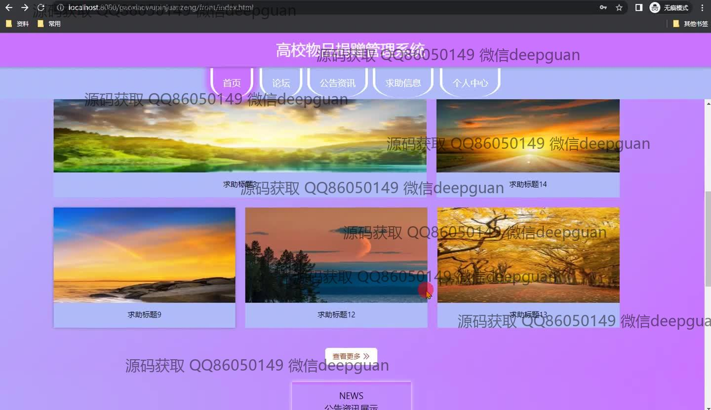

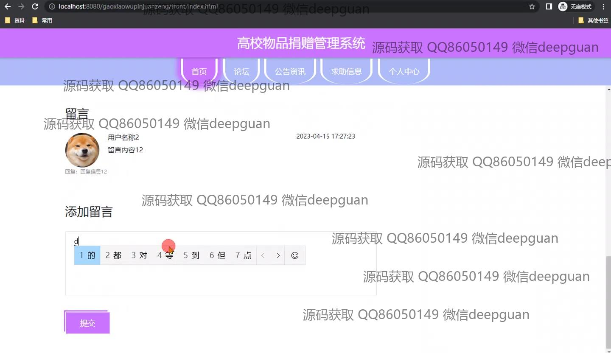
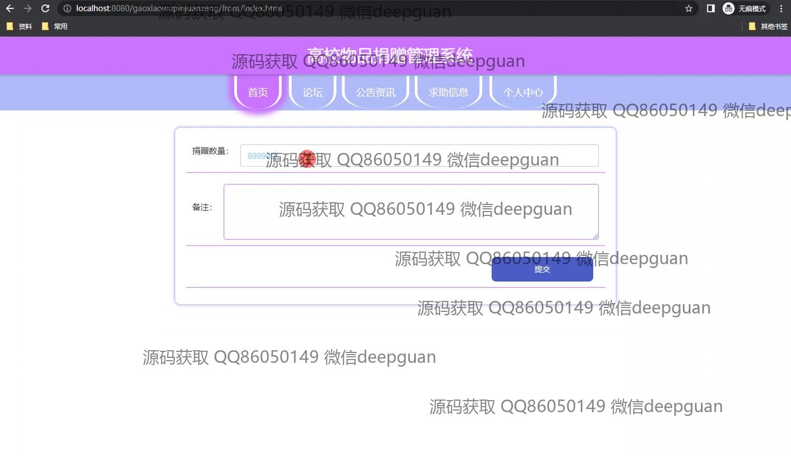
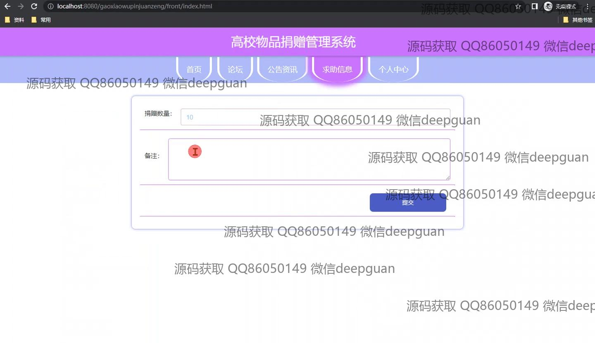
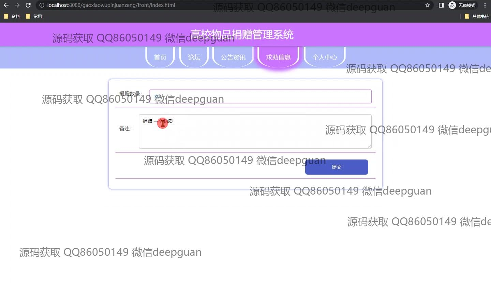
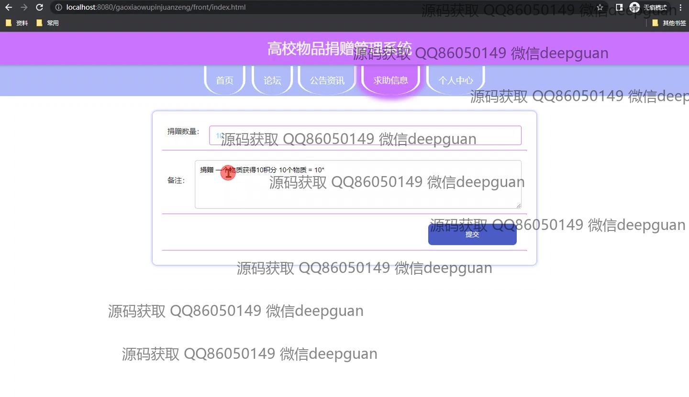
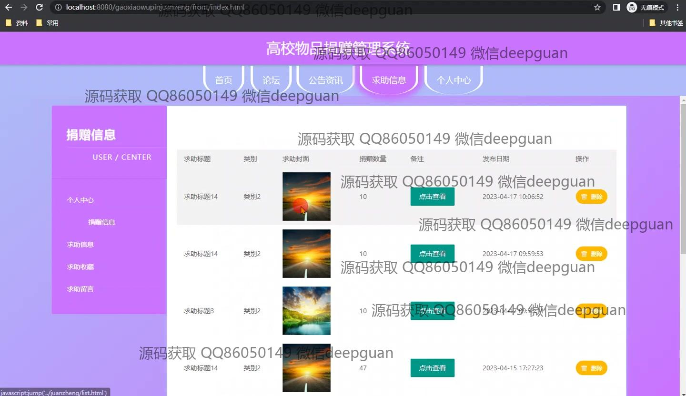
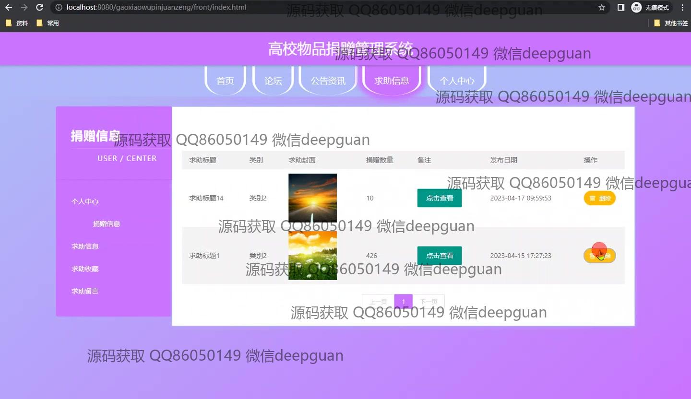
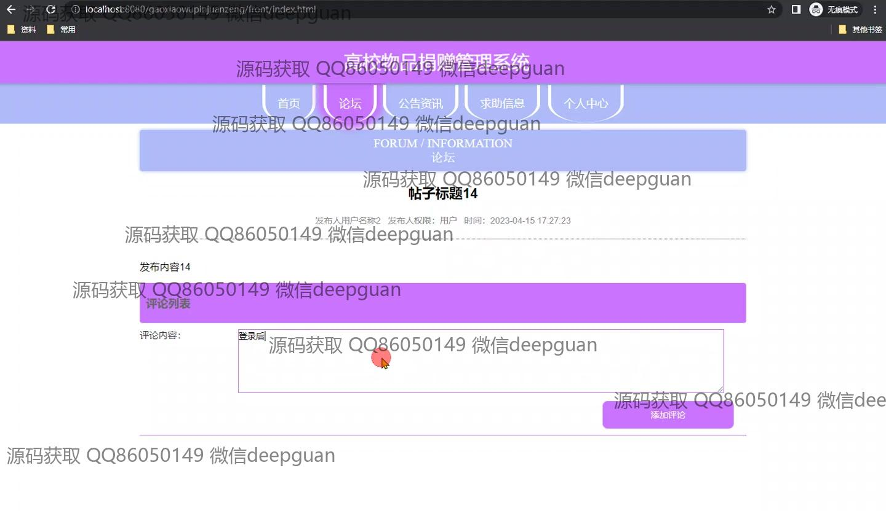
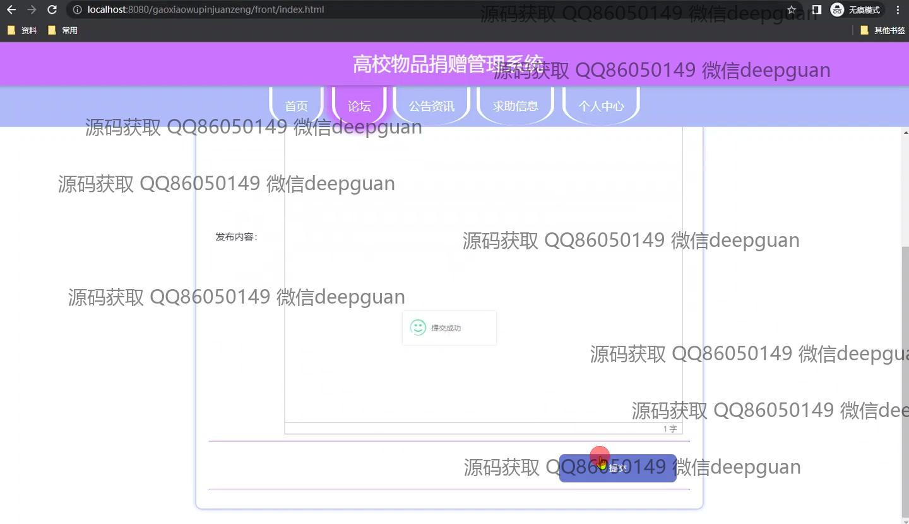
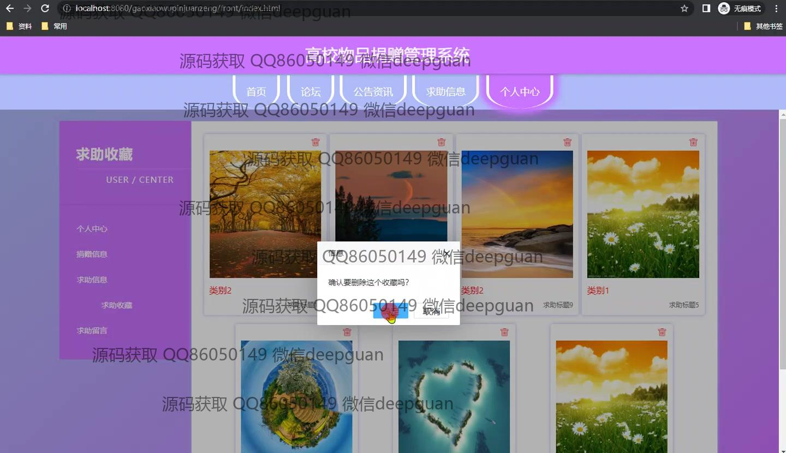
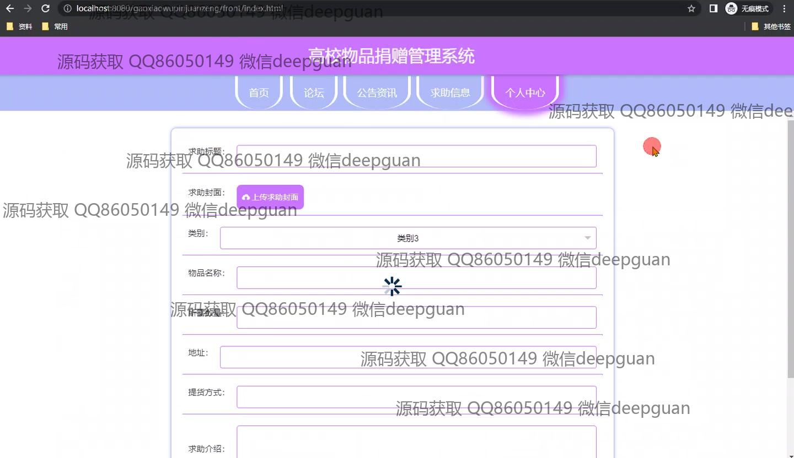
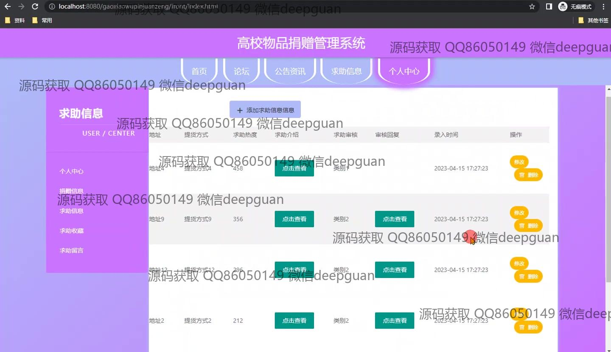
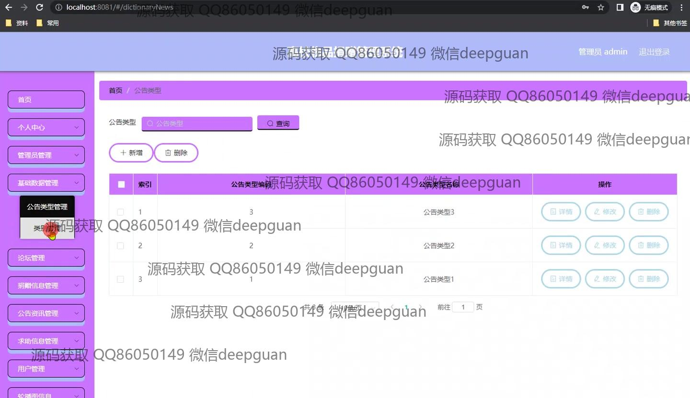
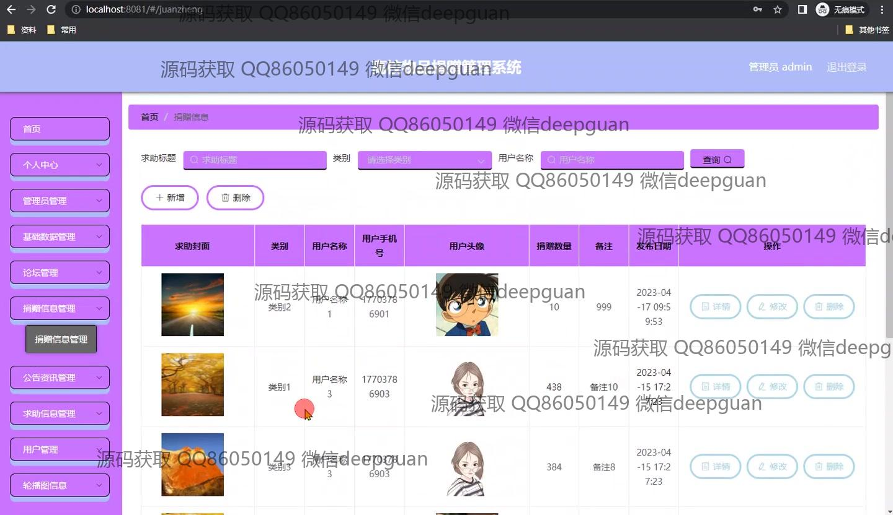
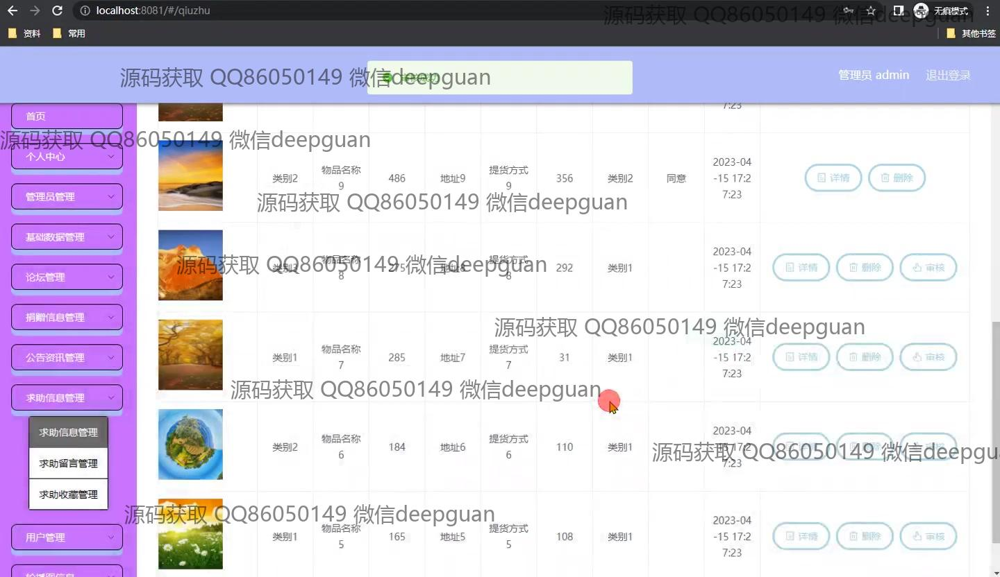
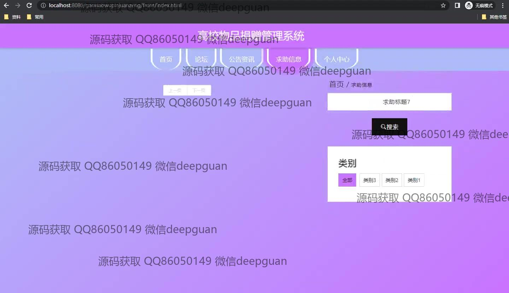
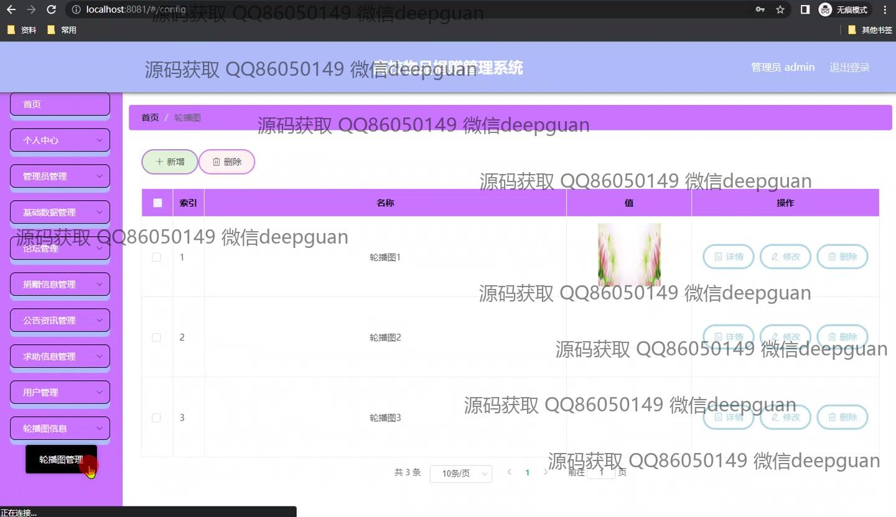

本代码来源于网络,仅供学习参考使用!

